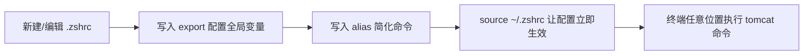

## 笔记

通过使用div标签，我们将整个页面按行划分，
而高度就是内部元素的高度

如果只希望按元素划分，也就是说元素占多大就划分多大的空间，
那么我们就可以使用span标签来划分：

### <label>

<label>（标签 / 标注）是 HTML 中专门用来绑定表单元素
（如输入框、复选框、单选框） 的标签

你想知道CSS中`#`和`.`的核心区别，我会用最通俗的语言+极简示例讲清楚，新手也能一眼看懂：

### 一、核心区别（一句话总结）
| 符号 | 含义                | 匹配目标               | 通俗理解               |
|------|---------------------|------------------------|------------------------|
| `#`  | ID选择器（IDセレクタ） | HTML元素的`id`属性     | 给元素“起唯一名字”，精准定位 |
| `.`  | 类选择器（クラスセレクタ） | HTML元素的`class`属性  | 给元素“贴标签”，批量样式复用 |

### 二、具体解释+示例（结合你的代码）
#### 1. `#title` → ID选择器
- **规则**：`#`后面跟的是HTML元素的`id`值，一个页面中**id必须唯一**（不能有两个`<div id="title">`）；
- **你的代码**：`#title { color: red; }` 表示“所有`id="title"`的元素，文字颜色设为红色”；
- **对应HTML**：
  ```html
  <!-- 只有这个元素会变红（id唯一） -->
  <h1 id="title">図書管理システム</h1>
  <!-- 下面这个不会生效（id不一样） -->
  <div id="title2">テスト</div>
  ```

#### 2. `.test` → 类选择器
- **规则**：`.`后面跟的是HTML元素的`class`值，一个页面中**class可以重复**（多个元素能共用同一个class）；
- **你的代码**：`.test { color: blue; }` 表示“所有`class="test"`的元素，文字颜色设为蓝色”；
- **对应HTML**：
  ```html
  <!-- 这三个元素都会变蓝（class复用） -->
  <p class="test">書籍名：Java入門</p>
  <div class="test">学生ID：1001</div>
  <span class="test">貸出状態：可</span>
  ```

### 三、关键注意点（新手必记）
1. **ID唯一，class可复用**：
    - ID像“身份证号”，一个页面只能有一个；
    - class像“职业标签”（比如“程序员”），多人可以共用；
2. **优先级不同**：
   ID选择器（`#`）优先级 > 类选择器（`.`）→ 若一个元素同时有`id="title"`和`class="test"`，文字会变红（ID优先级更高）；
   ```html
   <!-- 最终文字是红色（#title优先级更高） -->
   <h1 id="title" class="test">図書管理システム</h1>
   ```
3. **命名规范**：
    - ID/class只能以字母/下划线开头，不能有空格；
    - 多个class可空格分隔：`<div class="test box red">`（同时应用`.test`/`.box`/`.red`样式）。

### 四、完整示例（图书管理系统场景）
```html
<!DOCTYPE html>
<html lang="ja">
<head>
  <meta charset="UTF-8">
  <style>
    #page-title { /* ID选择器：唯一标题 */
      color: red;
      font-size: 24px;
    }
    .book-item { /* 类选择器：所有书籍项复用 */
      color: blue;
      margin: 10px 0;
    }
  </style>
</head>
<body>
  <h1 id="page-title">図書管理システム</h1> <!-- 红色大标题 -->
  <div class="book-item">書籍名：Java入門</div> <!-- 蓝色 -->
  <div class="book-item">書籍名：Python入門</div> <!-- 蓝色 -->
  <div class="book-item">書籍名：SQL入門</div> <!-- 蓝色 -->
</body>
</html>
```

### 总结
核心关键点：
1. `#` = ID选择器，匹配`id`属性，唯一不可重复，优先级高；
2. `.` = 类选择器，匹配`class`属性，可重复复用，优先级低；
3. 开发中：**通用样式用class**（比如所有书籍项），**唯一元素用ID**（比如页面标题）。

简单记：`#`找“唯一的那个”，`.`找“一群相同的”~


如果我们希望某个属性无视任何的优先级，我们可以在属性后面添加!


margin 和 padding能否帮我区分一下

你想分清CSS中`margin`（外边距）和`padding`（内边距）的核心区别，我会用最通俗的“盒子比喻”+ 可视化示例讲解，新手也能一眼看懂两者的作用和使用场景。

### 一、核心区别（一句话总结）
| 属性   | 中文名称 | 通俗理解                | 作用区域                  | 形象比喻                  |
|--------|----------|-------------------------|---------------------------|---------------------------|
| `margin` | 外边距   | 元素“外面”的空白        | 边框（border）之外的区域  | 你和隔壁桌子之间的空隙    |
| `padding` | 内边距   | 元素“里面”的空白        | 边框（border）之内的区域  | 你和自己桌子边缘的空隙    |

### 二、可视化盒子模型（新手最易理解）
CSS把每个HTML元素都看作一个“盒子”，结构从内到外是：
`内容（文字/图片）` → `padding（内边距）` → `border（边框）` → `margin（外边距）`

用一个“图书卡片”的例子直观展示：
```html
<!DOCTYPE html>
<html lang="ja">
<head>
  <meta charset="UTF-8">
  <style>
    .book-card {
      width: 200px;
      /* 内边距：内容和边框之间的空白（文字不会贴边框） */
      padding: 15px; 
      /* 边框：盒子的边界（方便看清楚范围） */
      border: 1px solid #ccc;
      /* 外边距：这个卡片和其他元素之间的空白 */
      margin: 20px; 
      background: #f9f9f9;
    }
  </style>
</head>
<body>
  <div class="book-card">
    書籍名：Java入門<br>
    価格：298円
  </div>
  <div class="book-card">
    書籍名：Python入門<br>
    価格：398円
  </div>
</body>
</html>
```
- `padding:15px`：卡片内的文字和边框之间有15px空白，文字不会紧贴边框；
- `margin:20px`：两个卡片之间有20px空白，不会挤在一起。

### 三、关键差异（新手必记）
#### 1. 影响范围不同
- `padding`：会**增加元素的总宽度/高度**（除非设置`box-sizing: border-box`）；
  比如上面的`.book-card`宽度设为200px，加了`padding:15px`后，实际宽度是`200 + 15*2 = 230px`；
- `margin`：不会影响元素自身大小，只影响和其他元素的间距；

#### 2. 背景色/背景图覆盖不同
- `padding`区域会显示元素的`background`（背景色/背景图）；
- `margin`区域是透明的，显示父元素的背景；

#### 3. 常用场景不同
| `margin` 典型用法                | `padding` 典型用法                |
|----------------------------------|-----------------------------------|
| 让元素居中（`margin: 0 auto`）   | 让文字/图片不贴边框              |
| 调整多个元素之间的间距（比如卡片之间） | 给按钮/输入框内部留空白（更美观） |
| 避免元素贴到页面边缘（比如body加margin） | 扩大可点击区域（比如按钮加padding） |

### 四、新手易踩坑的点
1. **margin合并问题**：垂直方向上，两个相邻元素的`margin`会“合并”（取最大值，而非相加）；
   比如A元素`margin-bottom: 10px`，B元素`margin-top: 20px`，实际间距是20px（不是30px）；
2. **padding撑大元素**：如果不想padding影响元素总大小，加`box-sizing: border-box`：
   ```css
   .book-card {
     box-sizing: border-box; /* 宽度包含padding和border */
     width: 200px;
     padding: 15px; /* 总宽度仍为200px，内容区域会缩小 */
   }
   ```

### 五、极简对比示例
```html
<!DOCTYPE html>
<html lang="ja">
<head>
  <style>
    .box1 {
      margin: 20px; /* 外面留20px空白 */
      padding: 20px; /* 里面留20px空白 */
      border: 1px solid red;
      background: #f0f0f0;
    }
    .box2 {
      margin: 10px; /* 只加外边距，和box1拉开距离 */
      border: 1px solid blue;
    }
  </style>
</head>
<body>
  <div class="box1">我是box1（有margin+padding）</div>
  <div class="box2">我是box2（只有margin）</div>
</body>
</html>
```
- 看`box1`：文字和红色边框之间的空白是`padding`，box1和box2之间的空白是`margin`；
- 看`box2`：文字紧贴蓝色边框（无padding），和box1之间的空白是自身的`margin`。

### 总结
核心关键点：
1. `margin`是“外间距”：管元素和外部的距离，不影响自身大小，透明；
2. `padding`是“内间距”：管元素内容和边框的距离，会撑大元素，有背景；
3. 记忆口诀：**margin管外，padding管内**；
4. 实用技巧：给元素内部留空白用padding，调整元素之间的距离用margin。

简单记：你写的图书管理系统中，给书籍卡片加`padding`让文字不贴边，加`margin`让卡片之间不挤——这就是两者最常用的场景~


## 前端界面的自适应 是怎么做的？

你想知道之前给你的登录界面中“前端网页自适应”的实现原理和具体代码逻辑，我会用通俗的语言拆解核心实现方式，同时补充更完整的自适应技巧，让你能举一反三应用到WebStudy项目中。

### 一、核心实现：登录界面的自适应关键代码
之前的登录界面主要通过**3个核心点**实现自适应，都是前端自适应的基础方法：

#### 1. 视口设置（最基础：让页面适配手机屏幕）
```html
<meta name="viewport" content="width=device-width, initial-scale=1.0">
```
- **作用**：这是移动端自适应的“开关”，告诉浏览器：
    - `width=device-width`：页面宽度等于设备屏幕宽度（比如手机375px、平板768px）；
    - `initial-scale=1.0`：页面初始缩放比例为1（不放大/缩小）；
- **如果不加**：手机会把页面当成电脑屏幕（980px）缩放显示，导致内容变小、需要手动放大。

#### 2. 宽度自适应（登录卡片适配不同屏幕）
```css
.login-container {
    width: 100%; /* 占满父容器宽度 */
    max-width: 400px; /* 最大宽度限制（电脑端不会太宽） */
}
```
- **逻辑**：
    - 手机端（屏幕<400px）：卡片宽度=屏幕宽度（比如375px），完全适配；
    - 电脑端（屏幕>400px）：卡片宽度固定400px，居中显示（不会无限变宽）；
- **通俗理解**：卡片“能屈不能伸”，手机上贴满屏幕，电脑上保持合适宽度。

#### 3. 弹性布局（让卡片垂直/水平居中，适配不同屏幕高度）
```css
body {
    display: flex;
    justify-content: center; /* 水平居中 */
    align-items: center; /* 垂直居中 */
    min-height: 100vh; /* 最小高度=屏幕高度（占满全屏） */
}
```
- **作用**：不管是手机（小屏幕）还是电脑（大屏幕），登录卡片始终在屏幕正中间，不会出现“手机上卡片偏上/偏下”的问题。

### 二、进阶：补充更多自适应技巧（适合WebStudy项目）
如果想让你的WebStudy项目适配更全面（比如不同屏幕尺寸的字体、间距），可以补充这些常用方法：

#### 1. 相对单位（代替固定像素，适配不同屏幕）
| 单位 | 含义 | 用法示例 |
|------|------|----------|
| `%` | 相对父容器百分比 | `padding: 5%;`（手机上padding小，电脑上padding大） |
| `rem` | 相对根节点（html）字体大小 | `font-size: 1.2rem;`（适配不同设备字体） |
| `vw/vh` | 相对屏幕宽度/高度（1vw=屏幕宽度的1%） | `width: 80vw;`（占屏幕80%宽度） |

**示例**：给登录界面加rem适配字体
```css
/* 根节点设置基准字体（手机端更小） */
html {
    font-size: 16px; /* 默认基准 */
}
/* 手机端（屏幕<768px）缩小基准字体 */
@media (max-width: 768px) {
    html {
        font-size: 14px;
    }
}
/* 用rem设置字体，自动适配 */
.login-title {
    font-size: 1.75rem; /* 1.75*16=28px（电脑），1.75*14=24.5px（手机） */
}
```

#### 2. 媒体查询（针对不同屏幕写不同样式）
这是“精准适配”的核心，比如手机端调整间距、隐藏不必要的元素：
```css
/* 屏幕宽度≤768px（平板/手机）时生效 */
@media (max-width: 768px) {
    .login-container {
        padding: 20px 15px; /* 手机端减少内边距 */
    }
    .login-title {
        font-size: 24px; /* 手机端标题更小 */
    }
}
/* 屏幕宽度≤480px（手机）时生效 */
@media (max-width: 480px) {
    .form-group input {
        padding: 12px 14px; /* 手机端输入框内边距更小 */
    }
}
```

### 三、完整自适应登录界面（补充进阶技巧）
```html
<!DOCTYPE html>
<html lang="ja">
<head>
    <meta charset="UTF-8">
    <!-- 核心：视口设置 -->
    <meta name="viewport" content="width=device-width, initial-scale=1.0">
    <title>システムへのログイン</title>
    <style>
        * {
            margin: 0;
            padding: 0;
            box-sizing: border-box;
            font-family: -apple-system, BlinkMacSystemFont, "Segoe UI", Roboto, "Helvetica Neue", Arial, sans-serif;
        }

        /* 基准字体适配 */
        html {
            font-size: 16px;
        }
        @media (max-width: 768px) {
            html {
                font-size: 14px;
            }
        }

        body {
            background: linear-gradient(135deg, #667eea 0%, #764ba2 100%);
            min-height: 100vh;
            display: flex;
            justify-content: center;
            align-items: center;
            padding: 10px; /* 手机端避免卡片贴边 */
        }

        .login-container {
            background: #ffffff;
            padding: 40px 30px;
            border-radius: 16px;
            box-shadow: 0 20px 40px rgba(0, 0, 0, 0.1);
            width: 100%;
            max-width: 400px;
        }

        .login-title {
            text-align: center;
            font-size: 1.75rem; /* rem单位适配 */
            font-weight: 600;
            color: #2d3748;
            margin-bottom: 32px;
        }

        .form-group {
            margin-bottom: 20px;
        }

        .form-group label {
            display: block;
            font-size: 0.875rem; /* 14px */
            color: #4a5568;
            margin-bottom: 8px;
        }

        .form-group input {
            width: 100%;
            padding: 14px 16px;
            border: 1px solid #e2e8f0;
            border-radius: 12px;
            font-size: 1rem; /* 16px */
            transition: all 0.3s ease;
        }

        .form-group input:focus {
            outline: none;
            border-color: #667eea;
            box-shadow: 0 0 0 3px rgba(102, 126, 234, 0.1);
        }

        .login-btn {
            width: 100%;
            padding: 14px;
            background: linear-gradient(135deg, #667eea 0%, #764ba2 100%);
            color: #ffffff;
            border: none;
            border-radius: 12px;
            font-size: 1rem;
            font-weight: 500;
            cursor: pointer;
            transition: transform 0.2s ease, box-shadow 0.2s ease;
            margin-top: 12px;
        }

        .login-btn:hover {
            transform: translateY(-2px);
            box-shadow: 0 10px 20px rgba(102, 126, 234, 0.2);
        }

        .login-btn:active {
            transform: translateY(0);
        }

        /* 媒体查询：手机端适配 */
        @media (max-width: 768px) {
            .login-container {
                padding: 20px 15px;
            }
            .form-group {
                margin-bottom: 15px;
            }
            .form-group input {
                padding: 12px 14px;
            }
        }
    </style>
</head>
<body>
    <div class="login-container">
        <h1 class="login-title">システムへのログイン</h1>
        <form>
            <div class="form-group">
                <label for="username">ユーザー名</label>
                <input type="text" id="username" placeholder="ユーザー名を入力してください">
            </div>
            <div class="form-group">
                <label for="password">パスワード</label>
                <input type="password" id="password" placeholder="パスワードを入力してください">
            </div>
            <button type="submit" class="login-btn">ログイン</button>
        </form>
    </div>
</body>
</html>
```

### 总结
前端网页自适应的核心关键点：
1. **基础开关**：`viewport`元标签，让页面适配手机屏幕宽度；
2. **宽度适配**：`width: 100% + max-width`，限制最大宽度，适配不同屏幕；
3. **弹性布局**：flex让元素居中，适配不同屏幕高度；
4. **进阶技巧**：相对单位（rem/vw）+ 媒体查询，精准调整不同屏幕的样式；

这些技巧完全可以复用在你的WebStudy项目中，比如做自适应的表单、卡片、导航栏等，核心思路都是“不写固定死的像素，让样式跟着屏幕变”。


## java 回调 + lambda表达式

回调的定义： 这种 “发起方调用响应方逻辑” 的模式，就是回调（Callback）。

我来用最通俗的方式，把这段代码的逻辑拆成“角色分工”和“执行流程”两部分，让你一看就懂。

---

### 1. 先看代码里的角色分工

这段代码里有三个关键角色：

1.  **`Test` 接口**
    ```java
    interface Test {
        void f(String str);
    }
    ```
    它就像一份“合同”，规定：
    - 谁要当我的“实现者”，就必须提供一个叫 `f` 的方法，
    - 这个方法接收一个字符串 `str`，没有返回值。

2.  **`test(Test t)` 方法**
    ```java
    private static void test(Test t) {
        t.f("这个是回调参数");
    }
    ```
    它是“任务发起方”：
    - 它需要一个“实现了 Test 接口的对象” `t`，
    - 然后调用 `t.f("这个是回调参数")`，把字符串传给对方，
    - 具体“拿到字符串后做什么”，它不管，交给对方去实现。

3.  **`main` 方法里的 Lambda**
    ```java
    test(str -> {
        System.out.println("接受到回调参数: " + str);
    });
    ```
    这是“任务响应方”，也就是**回调逻辑**：
    - 这里的 `str -> { ... }` 就是一个匿名的“Test 接口实现”，
    - 它定义了当 `f` 方法被调用时，要做的事：把传进来的 `str` 打印出来。

---

### 2. 再看完整的执行流程

我们把整个过程想象成“快递员（test方法）送包裹（回调参数）给收件人（Lambda）”：

1.  `main` 方法调用 `test(...)`，并把一段“收到包裹后要做什么”的逻辑（Lambda）交给 `test`。
2.  `test` 方法拿到这段逻辑（本质是一个实现了 `Test` 接口的对象 `t`），然后调用 `t.f("这个是回调参数")`，把包裹（字符串）送过去。
3.  这时，`t.f(...)` 就触发了我们在 Lambda 里写的逻辑：
    ```java
    str -> {
        System.out.println("接受到回调参数: " + str);
    }
    ```
    这里的 `str` 就是 `test` 传过来的 `"这个是回调参数"`，然后执行打印，输出：
    ```
    接受到回调参数: 这个是回调参数
    ```

---

### 3. 用“非Lambda”的写法对比，更清楚

如果不用 Lambda，这段代码会写成这样（匿名内部类），逻辑完全一样，只是写法更啰嗦：

```java
public static void main(String[] args) {
    // 用匿名内部类实现 Test 接口
    test(new Test() {
        @Override
        public void f(String str) {
            System.out.println("接受到回调参数: " + str);
        }
    });
}

interface Test {
    void f(String str);
}

private static void test(Test t) {
    t.f("这个是回调参数");
}
```

- `new Test() { ... }` 就是“临时实现了 Test 接口的对象”，
- 里面的 `f` 方法，就是“回调逻辑”，
- 和 Lambda 的作用完全一样，只是 Lambda 把冗余的语法去掉了，更简洁。

---

### 4. 一句话总结

- **`test` 方法**：我是发起方，我会调用你给我的逻辑，并把参数传过去。
- **Lambda / 匿名内部类**：我是响应方，你把参数传给我，我就按我写的逻辑处理。
- 这种“发起方调用响应方逻辑”的模式，就是**回调（Callback）**。

---

要不要我帮你把这段代码改成**更贴近你之前学的 Consumer 函数式接口**的版本，让你看到 Java 8+ 回调写法的演进？


## tomcat安装位置

你想找到通过 Homebrew 安装的 Tomcat 具体位置，我会给你 **3个简单且百分百有效的方法**，从易到难，新手也能快速找到：

### 方法1：用 Homebrew 自带命令（最推荐，一步到位）
直接在终端执行下面的命令，会**精准输出 Tomcat 的安装目录**：
```bash
brew --prefix tomcat
```
#### 执行效果示例：
- Intel 芯片 Mac：输出 `/usr/local/opt/tomcat`
- M1/M2/M3 芯片 Mac：输出 `/opt/homebrew/opt/tomcat`

这个目录是 Homebrew 给 Tomcat 创建的“软链接目录”，指向实际安装位置（后续操作直接用这个目录即可）。

### 方法2：查看 Homebrew 安装详情（能看到更多信息）
执行下面的命令，会列出 Tomcat 的安装路径、依赖、配置文件位置等：
```bash
brew info tomcat
```
#### 关键信息解读：
输出里会有一行类似：
```
/usr/local/Cellar/tomcat/10.1.19 (267 files, 18.9MB) *
  Built from source on 2026-02-21 at 16:50:12
From: https://github.com/Homebrew/homebrew-core/blob/HEAD/Formula/t/tomcat.rb
==> Dependencies
Build: ant ✔, openjdk@17 ✔
Required: openjdk@17 ✔
==> Caveats
NOTE: When using launchctl the TOMCAT_HOME variable is not set.
==> Analytics
install: 17,989 (30 days), 54,123 (90 days), 201,387 (365 days)
install-on-request: 17,968 (30 days), 54,082 (90 days), 201,298 (365 days)
build-error: 0 (30 days)
```
其中 `/usr/local/Cellar/tomcat/10.1.19` 就是 Tomcat 的**实际安装目录**（`10.1.19` 是版本号，你的会不一样）。

### 方法3：通过启动标签定位（适合确认运行中的 Tomcat）
你看到的 `label: homebrew.mxcl.tomcat` 是 Homebrew 管理的服务标签，执行下面的命令能找到配置文件（里面包含安装路径）：
```bash
brew services info tomcat
```
#### 执行效果示例：
```
tomcat (homebrew.mxcl.tomcat)
Running: ✔
Loaded: ✔
Schedulable: ✘
User: xuyaochen
PID: 12345
```
如果想进一步看配置，执行：
```bash
cat ~/Library/LaunchAgents/homebrew.mxcl.tomcat.plist
```
里面会有一行 `<string>/usr/local/opt/tomcat/bin/catalina.sh</string>`，这就是 Tomcat 核心脚本的路径，前面的 `/usr/local/opt/tomcat` 就是安装目录。

### 补充：为什么 `whereis tomcat` 找不到？
`whereis` 是系统默认的查找命令，只搜索 `/bin`/`/usr/bin` 等系统目录，但 Homebrew 安装的 Tomcat 不在这些目录里，且没有创建 `tomcat` 全局命令，所以会返回空——这也是你执行 `tomcat` 提示 `command not found` 的原因。

### 快速验证：进入 Tomcat 目录并操作
找到目录后，执行下面的命令就能进入 Tomcat 的 `bin` 目录（替换成你查到的路径）：
```bash
# Intel 芯片
cd /usr/local/opt/tomcat/bin
# M 芯片
cd /opt/homebrew/opt/tomcat/bin
```
然后就能执行启动/停止命令：
```bash
# 启动
./catalina.sh start
# 停止
./catalina.sh stop
# 查看状态
./catalina.sh status
```

### 总结
核心关键点：
1. 最快找安装位置：`brew --prefix tomcat`；
2. 看详细信息：`brew info tomcat`；
3. `whereis`/直接输 `tomcat` 找不到，是因为 Homebrew 没把 Tomcat 命令加入系统环境变量；
4. 操作 Tomcat 需进入 `bin` 目录，执行 `./catalina.sh` 脚本（不能直接输 `tomcat`）。

如果想把 Tomcat 做成全局命令（终端任意位置输 `tomcat start` 就能启动），我可以教你配置环境变量，需要吗？


Mac的我是用homebrew下载的jdk17和tomcat8下好了以后在zshrc里写一下环境变量就可以了


## mac下如何配置 tomcat的环境变量

你想把 Tomcat 配置成**全局命令**（终端任意位置输 `tomcat start`/`stop` 就能操作），我会用最稳妥的步骤教你配置环境变量，全程复制命令就能搞定，新手也不会出错👇

### 核心思路
通过配置系统的 `PATH` 环境变量，把 Tomcat 的 `bin` 目录加入系统“可识别命令的路径”，再给核心脚本 `catalina.sh` 做一个简化别名（比如 `tomcat`），就能实现全局调用。

### 步骤1：先确认 Tomcat 的 bin 目录路径（关键）
先执行下面的命令，复制输出的路径（这是 Tomcat 的 `bin` 目录，后续要用）：
```bash
# 自动获取 Tomcat 的 bin 目录路径并输出
echo "$(brew --prefix tomcat)/bin"
```
#### 输出示例：
- Intel 芯片 Mac：`/usr/local/opt/tomcat/bin`
- M1/M2/M3 芯片 Mac：`/opt/homebrew/opt/tomcat/bin`

### 步骤2：配置环境变量（永久生效，适配 zsh/bash）
Mac 终端默认用 `zsh`（如果是老系统用 `bash`，步骤也兼容），执行下面的命令**一键配置**：
```bash
# 1. 打开环境变量配置文件（zsh 用 .zshrc，bash 用 .bash_profile）
if [ -f ~/.zshrc ]; then
  CONFIG_FILE=~/.zshrc
else
  CONFIG_FILE=~/.bash_profile
fi

# 2. 写入环境变量和别名（复制时直接整段执行）
cat >> $CONFIG_FILE << 'EOF'

# Tomcat 全局命令配置
export TOMCAT_HOME=$(brew --prefix tomcat)
export PATH=$PATH:$TOMCAT_HOME/bin
# 给 catalina.sh 起别名：tomcat（简化命令）
alias tomcat='catalina.sh'
EOF

# 3. 生效配置
source $CONFIG_FILE
```

### 步骤3：验证配置是否成功
执行下面的命令，输出 `tomcat` 命令的路径，说明配置成功：
```bash
# 查看 tomcat 别名是否生效
which tomcat
# 查看 PATH 是否包含 Tomcat 的 bin 目录
echo $PATH | grep tomcat
```

### 步骤4：测试全局命令（任意目录都能执行）
现在终端**任意位置**都能执行这些命令操作 Tomcat：
```bash
# 启动 Tomcat
tomcat start

# 停止 Tomcat
tomcat stop

# 重启 Tomcat
tomcat restart

# 查看 Tomcat 状态
tomcat status

# 查看 Tomcat 版本
tomcat version
```

### 补充：常见问题解决
#### 问题1：执行 `tomcat start` 提示“权限不足”
执行下面的命令给 Tomcat 脚本加执行权限：
```bash
chmod +x $(brew --prefix tomcat)/bin/*.sh
```

#### 问题2：配置后新开终端命令失效
重新执行生效命令即可：
```bash
# zsh
source ~/.zshrc
# bash
source ~/.bash_profile
```

#### 问题3：想删除全局命令（恢复原状）
打开环境变量配置文件，删除下面这段内容即可：
```bash
# 打开配置文件
open ~/.zshrc # 或 open ~/.bash_profile
# 删除以下内容：
# Tomcat 全局命令配置
export TOMCAT_HOME=$(brew --prefix tomcat)
export PATH=$PATH:$TOMCAT_HOME/bin
alias tomcat='catalina.sh'
# 保存后生效
source ~/.zshrc # 或 source ~/.bash_profile
```

### 总结
核心关键点：
1. 配置核心：把 Tomcat 的 `bin` 目录加入 `PATH`，并给 `catalina.sh` 起别名 `tomcat`；
2. 永久生效：写入 `.zshrc`/`.bash_profile`，并执行 `source` 生效；
3. 全局命令：任意目录执行 `tomcat start/stop/restart` 即可操作 Tomcat；
4. 验证成功：`which tomcat` 能查到路径，就说明配置没问题。

现在你可以在终端任意位置操作 Tomcat 了，比如桌面、文档目录输 `tomcat start` 都能启动，不用再切换到 Tomcat 的 bin 目录啦～


自己电脑的配置：.zshrc的这个文件里面

/Users/xuyaochen 

# Tomcat 全局命令配置（新增）
export TOMCAT_HOME=/usr/local/Cellar/tomcat/11.0.18
export PATH=$PATH:$TOMCAT_HOME/bin
alias tomcat='$TOMCAT_HOME/bin/catalina'


没错！从输出的信息来看，你的 Tomcat 配置已经**完全正确**了，这是成功的关键信号👇

### 先解读成功的核心证据
你执行 `tomcat version` 后输出的这些内容，是 Tomcat 正常响应的标志：
- `Server version: Apache Tomcat/11.0.18`：Tomcat 版本识别成功；
- `Using CATALINA_HOME: /usr/local/Cellar/tomcat/11.0.18/libexec`：系统正确识别了 Tomcat 的核心目录；
- 没有任何 `command not found`/`no such file or directory` 报错；

这说明：
1. 你配置的路径（`/usr/local/Cellar/tomcat/11.0.18/libexec`）是 Tomcat 11 的**真实核心目录**；
2. `tomcat` 别名已经正确指向了 Tomcat 11 的启动脚本；
3. 环境变量和别名配置都生效了。

### 最后验证：启动 Tomcat 并访问
执行下面的命令启动 Tomcat：
```bash
tomcat start
```
启动成功后，打开浏览器访问：
```
http://localhost:8080
```
如果能看到 Tomcat 的默认欢迎页面（有小猫logo、“Apache Tomcat/11.0.18”字样），就彻底确认所有配置都没问题了。

### 补充：常用命令（现在都能正常执行）
现在你在终端**任意目录**都能操作 Tomcat：
| 命令                | 作用                  |
|---------------------|-----------------------|
| `tomcat start`      | 启动 Tomcat           |
| `tomcat stop`       | 停止 Tomcat           |
| `tomcat restart`    | 重启 Tomcat           |
| `tomcat version`    | 查看 Tomcat 版本（你已验证） |
| `tomcat status`     | 查看 Tomcat 运行状态  |

### 总结
核心关键点：
1. ✅ 配置生效：`tomcat version` 能输出版本信息，说明别名和路径配置完全正确；
2. ✅ 路径正确：Tomcat 11 的核心目录确实在 `libexec` 下（这是 Tomcat 11 的新目录结构）；
3. ✅ 可用状态：现在可以正常启动/停止 Tomcat，完成后续开发使用。

你已经完美解决了“命令找不到”“路径错误”的问题，现在可以放心使用 Tomcat 做开发了～


你想系统学习这次配置中用到的核心命令/符号（`source`、`~`、`export`、`open -e`）和 `.zshrc` 文件的本质，我会用最通俗的语言+实战示例讲解，新手也能一次性理解👇

### 一、先搞懂「符号/命令」的核心含义（逐个拆解）
#### 1. `~`：用户主目录的“快捷符号”
- **核心含义**：等价于你的 Mac 用户主目录（`/Users/你的用户名/`，比如你的是 `/Users/xuyaochen/`），是系统提供的“快捷写法”；
- **通俗理解**：就像你给“家”起的昵称，不用写完整路径，输 `~` 就代表“我的主目录”；
- **实战示例**：
  ```bash
  cd ~          # 进入用户主目录（等价于 cd /Users/xuyaochen）
  ls ~          # 查看主目录下的所有文件
  open ~/.zshrc # 打开主目录下的 .zshrc 文件
  ```
- **补充**：`..` 代表“上一级目录”，`.` 代表“当前目录”，和 `~` 是最常用的目录快捷符号。

#### 2. `export`：设置“全局环境变量”
- **核心含义**：把变量从“当前终端会话的局部变量”升级为“全局环境变量”，让所有子进程（比如新开的终端、执行的脚本）都能读取到这个变量；
- **通俗理解**：就像给系统贴“全局标签”，比如 `export TOMCAT_HOME=/xxx`，就是告诉系统“不管在哪个终端/目录，只要找 `TOMCAT_HOME`，就去 `/xxx` 这个路径”；
- **实战对比（一看就懂）**：
  ```bash
  # 仅当前终端生效（局部变量，新开终端就没了）
  TOMCAT_HOME=/usr/local/Cellar/tomcat/11.0.18/libexec
  echo $TOMCAT_HOME # 能输出路径，但新开终端执行 echo $TOMCAT_HOME 会空
  
  # 全局生效（加 export，所有终端/脚本都能读取）
  export TOMCAT_HOME=/usr/local/Cellar/tomcat/11.0.18/libexec
  ```
- **关键用途**：配置 `PATH`（系统查找命令的路径）、`JAVA_HOME`、`TOMCAT_HOME` 等全局路径时，必须加 `export`。

#### 3. `source`：立即加载配置文件（不用重启终端）
- **核心含义**：在当前终端会话中执行指定文件里的命令，让配置立即生效（而非新开终端才生效）；
- **通俗理解**：修改了 `.zshrc` 后，系统不会“自动刷新”，`source ~/.zshrc` 就是“手动通知系统：我改配置了，立刻生效！”；
- **实战场景**：
  ```bash
  # 修改 .zshrc 后，执行下面的命令让配置生效
  source ~/.zshrc 
  # 等价写法（效果完全一样）
  . ~/.zshrc 
  ```
- **对比**：如果不执行 `source`，必须关闭终端再重新打开，配置才会生效（效率低）。

#### 4. `open -e`：用系统「文本编辑」打开文件（可视化编辑）
- **核心含义**：`open` 是 Mac 打开文件/目录的命令，`-e` 是参数，指定“用系统自带的文本编辑App打开文件”；
- **通俗理解**：专门给新手用的“可视化编辑命令”，不用记复杂的终端编辑器（vim/nano），直接打开熟悉的文本编辑窗口；
- **实战示例**：
  ```bash
  open -e ~/.zshrc # 用文本编辑打开 .zshrc（没有就新建）
  open -e ~/Desktop/test.txt # 打开桌面的 test.txt 文件
  ```
- **补充**：如果不加 `-e`，`open ~/.zshrc` 会用“默认程序”打开（比如 Xcode/VSCode），`-e` 强制用系统文本编辑，更简单。

### 二、核心配置文件：`.zshrc` 是什么？
#### 1. 本质
`.zshrc` 是 **zsh 终端的“启动配置文件”**，位于用户主目录（`~/.zshrc`），是纯文本文件：
- `.` 开头：隐藏文件（Mac 默认不显示，`ls -a` 才能看到）；
- `zshrc`：zsh run commands（zsh 运行时执行的命令）；
- 作用：每次打开 zsh 终端，系统会自动执行 `.zshrc` 里的所有命令。

#### 2. 核心用途（为什么要配置它？）
把需要“每次打开终端都生效”的配置写进去，比如：
- 环境变量（`export PATH`/`export TOMCAT_HOME`）；
- 命令别名（`alias tomcat='xxx'`，简化长命令）；
- 自定义终端样式、快捷键等。

#### 3. 关键特性
| 特性                | 说明                                  |
|---------------------|---------------------------------------|
| 永久生效            | 写进 `.zshrc` 的配置，所有新终端都生效 |
| 用户级配置          | 只对当前用户生效，不影响其他用户      |
| 纯文本可编辑        | 用任何文本编辑器都能改（文本编辑/vim/nano） |

### 三、实战串联：完整配置流程的逻辑（回顾+理解）
我们配置 Tomcat 全局命令的过程，本质是：

拆解每一步的意义：
1. `open -e ~/.zshrc`：打开配置文件（可视化）；
2. `export TOMCAT_HOME=xxx`：设置全局路径变量；
3. `export PATH=$PATH:$TOMCAT_HOME/bin`：把 Tomcat 的 bin 目录加入系统“命令查找路径”；
4. `alias tomcat='xxx'`：给长脚本起短别名；
5. `source ~/.zshrc`：让配置立刻生效，不用重启终端；
6. 后续打开新终端：系统自动执行 `.zshrc` 里的配置，`tomcat` 命令永久生效。

### 四、新手易踩坑的点
1. **`.zshrc` 不存在**：Mac 默认不自动创建，第一次用 `open -e ~/.zshrc` 会新建；
2. **`source` 拼写错误**：别写成 `souce`，正确是 `source ~/.zshrc`；
3. **`export` 漏写**：只写 `TOMCAT_HOME=xxx` 是局部变量，新开终端就失效；
4. **隐藏文件看不到**：`ls ~` 看不到 `.zshrc`，必须加 `-a`（`ls -a ~`）显示隐藏文件。

### 总结
核心关键点：
1. `~`：用户主目录快捷符号，等价于 `/Users/你的用户名/`；
2. `export`：设置全局环境变量，让所有终端/脚本都能读取；
3. `source`：立即加载配置文件，不用重启终端；
4. `open -e`：用系统文本编辑打开文件（新手可视化编辑首选）；
5. `.zshrc`：zsh 终端的启动配置文件，写进去的配置永久生效，是配置全局命令/环境变量的核心文件。

这些是 Mac 终端最基础也最常用的知识点，掌握后不管配置 Java、Python、Node.js 等环境，都能举一反三～